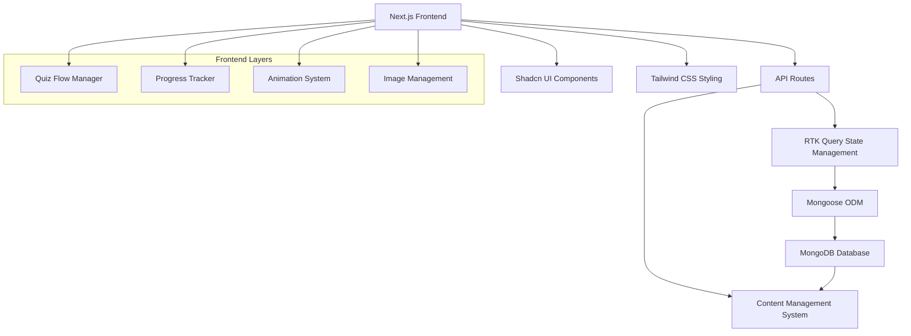
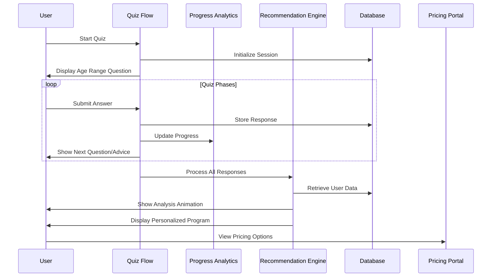

# Beauty Quiz Webapp Design Document

## Overview

The Beauty Quiz Webapp is a sophisticated, aesthetically-driven web application that guides users through a personalized beauty assessment journey. The system employs a phased questionnaire approach with dynamic content delivery, real-time progress tracking, and AI-driven recommendation generation to create personalized beauty programs.

## Architecture

### High-Level Architecture



### System Flow



### Database Layer & State Management

#### Mongoose ODM Integration

- **Schema Definition**: Structured data models with validation and middleware
- **Connection Management**: Optimized connection pooling and error handling
- **Data Validation**: Built-in schema validation and custom validators
- **Middleware Support**: Pre/post hooks for data processing and auditing

#### Global State Management Strategy

- **RTK Query**: Primary API state management with caching and real-time updates
- **Redux Toolkit**: Global application state for quiz flow and user session
- **Real-time Updates**: Optimistic updates and background synchronization
- **State Persistence**: Session storage integration for quiz progress recovery

```typescript
// Global state structure
interface AppState {
  quiz: QuizState;
  user: UserState;
  ui: UIState;
  recommendations: RecommendationState;
}

interface QuizState {
  currentSession: QuizSession | null;
  currentQuestion: Question | null;
  progress: ProgressState;
  answers: QuizResponse[];
  isLoading: boolean;
}
```

## Components and Interfaces

### Core Components

#### 1. Quiz Flow Manager

- **Purpose**: Orchestrates the entire quiz experience
- **Key Features**:
  - Dynamic question routing based on previous answers
  - Phase management and transition logic
  - Session state persistence
  - Answer validation and storage

#### 2. Question Card Component

- **Purpose**: Displays individual questions in flashcard format
- **Key Features**:
  - Animated transitions between questions
  - Multiple choice option rendering
  - Background image integration
  - Responsive design for all screen sizes

#### 3. Progress Tracker Component

- **Purpose**: Visual progress indication across quiz phases
- **Key Features**:
  - Phase-based progress visualization
  - Completion status indicators
  - Smooth progress animations
  - Mobile-optimized display

#### 4. Advice Display Component

- **Purpose**: Shows personalized tips and medical advice
- **Key Features**:
  - Rich content formatting
  - Image and text integration
  - Smooth reveal animations
  - Medical disclaimer handling

#### 5. Analysis Animation Component

- **Purpose**: Engaging loading experience during recommendation generation
- **Key Features**:
  - Multi-stage progress indicators
  - Beauty-themed animations
  - User testimonial integration
  - Realistic processing time simulation

#### 6. Recommendation Display Component

- **Purpose**: Presents personalized beauty programs
- **Key Features**:
  - Structured routine presentation
  - Product recommendation integration
  - Timeline visualization
  - Export and sharing capabilities

### API Interface Design

#### Quiz Management APIs

```typescript
// Quiz session management
POST /api/quiz/start
GET /api/quiz/session/:sessionId
PUT /api/quiz/session/:sessionId/answer
GET /api/quiz/session/:sessionId/progress

// Question flow APIs
GET /api/quiz/questions/next/:sessionId
GET /api/quiz/phases/:phaseId/advice
```

#### Recommendation APIs

```typescript
// Analysis and recommendation generation
POST /api/recommendations/generate/:sessionId
GET /api/recommendations/:sessionId
GET /api/recommendations/:sessionId/export
```

#### Content Management APIs

```typescript
// Dynamic content delivery
GET /api/content/questions/:questionId
GET /api/content/advice/:adviceId
GET /api/content/images/:context
```

## Data Models

### User Session Model

```typescript
interface QuizSession {
  id: string;
  userId?: string; // Optional for anonymous users
  startedAt: Date;
  completedAt?: Date;
  currentPhase: number;
  currentQuestionId: string;
  responses: QuizResponse[];
  progress: ProgressState;
  personalizedProgram?: PersonalizedProgram;
}
```

### Quiz Response Model

```typescript
interface QuizResponse {
  questionId: string;
  selectedOption: string;
  timestamp: Date;
  phaseId: number;
  metadata?: {
    timeSpent: number;
    revisited: boolean;
  };
}
```

### Question Model

```typescript
interface Question {
  id: string;
  phaseId: number;
  text: string;
  subtitle?: string;
  options: QuestionOption[];
  backgroundImage: string;
  nextQuestionLogic: NextQuestionRule[];
  adviceTriggered?: boolean;
}

interface QuestionOption {
  id: string;
  text: string;
  value: string;
  nextQuestionId?: string;
}
```

### Personalized Program Model

```typescript
interface PersonalizedProgram {
  id: string;
  sessionId: string;
  generatedAt: Date;
  skinAnalysis: SkinAnalysis;
  recommendedRoutine: BeautyRoutine;
  productRecommendations: ProductRecommendation[];
  medicalAdvice: MedicalAdvice[];
  timeline: RoutineTimeline;
}
```

## Error Handling

### Client-Side Error Handling

- **Network Failures**: Implement retry logic with exponential backoff
- **Session Expiry**: Graceful session restoration with progress preservation
- **Validation Errors**: Real-time feedback with clear error messaging
- **Image Loading**: Fallback images and progressive loading strategies

### Server-Side Error Handling

- **Database Connectivity**: Connection pooling and failover mechanisms
- **API Rate Limiting**: Graceful degradation and user feedback
- **Recommendation Generation**: Fallback to template-based recommendations
- **Payment Processing**: Comprehensive error handling with user guidance

### Error Recovery Strategies

```typescript
// Session recovery implementation
const recoverSession = async (sessionId: string) => {
  try {
    const session = await getSession(sessionId);
    if (!session) {
      return redirectToQuizStart();
    }
    return resumeFromLastQuestion(session);
  } catch (error) {
    logError("Session recovery failed", error);
    return gracefulFallback();
  }
};
```

## Testing Strategy

### Unit Testing

- **Component Testing**: Individual React component functionality
- **API Testing**: Endpoint validation and response verification
- **Utility Testing**: Helper functions and data transformation logic
- **State Management**: RTK Query slice and reducer testing

### Integration Testing

- **Quiz Flow Testing**: End-to-end question progression
- **Database Integration**: Data persistence and retrieval validation
- **Recommendation Engine**: Algorithm accuracy and performance
- **Payment Integration**: Subscription flow and webhook handling

### User Experience Testing

- **Performance Testing**: Page load times and animation smoothness
- **Accessibility Testing**: Screen reader compatibility and keyboard navigation
- **Cross-Browser Testing**: Compatibility across major browsers
- **Mobile Responsiveness**: Touch interactions and responsive layouts

### Testing Implementation

```typescript
// Example component test structure
describe("QuestionCard Component", () => {
  it("should render question with options", () => {
    // Test implementation
  });

  it("should handle option selection", () => {
    // Test implementation
  });

  it("should display background image correctly", () => {
    // Test implementation
  });
});
```

## Performance Considerations

### Frontend Optimization

- **Image Optimization**: Next.js Image component with lazy loading
- **Code Splitting**: Route-based and component-based splitting
- **Caching Strategy**: Browser caching for static assets
- **Bundle Optimization**: Tree shaking and minification

### Backend Optimization

- **Database Indexing**: Optimized queries for session and response data
- **API Caching**: Redis caching for frequently accessed content
- **CDN Integration**: Global content delivery for images and assets
- **Connection Pooling**: Efficient database connection management

### User Experience Optimization

- **Progressive Loading**: Skeleton screens and loading states
- **Prefetching**: Next question and image preloading
- **Offline Support**: Service worker for basic offline functionality
- **Animation Performance**: Hardware-accelerated CSS animations

## Security Considerations

### Data Protection

- **Input Validation**: Comprehensive server-side validation
- **SQL Injection Prevention**: Parameterized queries and ORM usage
- **XSS Protection**: Content sanitization and CSP headers
- **CSRF Protection**: Token-based request validation

### Privacy Compliance

- **Data Minimization**: Collect only necessary user information
- **Consent Management**: Clear privacy policy and user consent
- **Data Retention**: Automated cleanup of expired sessions
- **Anonymization**: Option for anonymous quiz completion

### Infrastructure Security

- **HTTPS Enforcement**: SSL/TLS encryption for all communications
- **Environment Variables**: Secure configuration management
- **API Rate Limiting**: Protection against abuse and DoS attacks
- **Monitoring**: Security event logging and alerting

## Additional Technical Specifications

### Mongoose Integration Details

#### Schema Definitions with Validation

```typescript
// Enhanced Quiz Session Schema with Mongoose
import mongoose from "mongoose";

const QuizSessionSchema = new mongoose.Schema(
  {
    sessionId: { type: String, required: true, unique: true },
    userId: { type: String, required: false },
    startedAt: { type: Date, default: Date.now },
    completedAt: { type: Date, required: false },
    currentPhase: { type: Number, default: 1, min: 1, max: 10 },
    currentQuestionId: { type: String, required: true },
    responses: [{ type: mongoose.Schema.Types.ObjectId, ref: "QuizResponse" }],
    progress: {
      currentPhase: { type: Number, required: true },
      totalPhases: { type: Number, required: true },
      questionsAnswered: { type: Number, default: 0 },
      completionPercentage: { type: Number, default: 0, min: 0, max: 100 },
    },
    personalizedProgram: {
      type: mongoose.Schema.Types.ObjectId,
      ref: "PersonalizedProgram",
    },
    isActive: { type: Boolean, default: true },
  },
  {
    timestamps: true,
    collection: "quiz_sessions",
  },
);

// Pre-save middleware for progress calculation
QuizSessionSchema.pre("save", function (next) {
  if (this.responses && this.progress.totalPhases) {
    this.progress.questionsAnswered = this.responses.length;
    this.progress.completionPercentage = Math.round(
      (this.responses.length / this.progress.totalPhases) * 100,
    );
  }
  next();
});

const QuizResponseSchema = new mongoose.Schema(
  {
    sessionId: { type: String, required: true },
    questionId: { type: String, required: true },
    selectedOption: { type: String, required: true },
    phaseId: { type: Number, required: true },
    timeSpent: { type: Number, default: 0 }, // in seconds
    revisited: { type: Boolean, default: false },
  },
  { timestamps: true },
);
```

### Global State Management Architecture

#### RTK Query Configuration for Real-time Updates

```typescript
// API slice with real-time capabilities
import { createApi, fetchBaseQuery } from "@reduxjs/toolkit/query/react";

export const beautyQuizApi = createApi({
  reducerPath: "beautyQuizApi",
  baseQuery: fetchBaseQuery({
    baseUrl: "/api/",
    prepareHeaders: (headers, { getState }) => {
      // Add session token if available
      const token = (getState() as RootState).auth.token;
      if (token) {
        headers.set("authorization", `Bearer ${token}`);
      }
      return headers;
    },
  }),
  tagTypes: ["QuizSession", "Question", "Progress", "Recommendation"],
  endpoints: (builder) => ({
    // Quiz session management with optimistic updates
    startQuizSession: builder.mutation<QuizSession, void>({
      query: () => ({
        url: "quiz/start",
        method: "POST",
      }),
      invalidatesTags: ["QuizSession"],
    }),

    submitAnswer: builder.mutation<QuizSession, SubmitAnswerRequest>({
      query: ({ sessionId, answer }) => ({
        url: `quiz/session/${sessionId}/answer`,
        method: "PUT",
        body: answer,
      }),
      // Optimistic update for immediate UI feedback
      async onQueryStarted(
        { sessionId, answer },
        { dispatch, queryFulfilled },
      ) {
        const patchResult = dispatch(
          beautyQuizApi.util.updateQueryData(
            "getQuizSession",
            sessionId,
            (draft) => {
              draft.responses.push(answer);
              draft.progress.questionsAnswered += 1;
              draft.progress.completionPercentage = Math.round(
                (draft.responses.length / draft.progress.totalPhases) * 100,
              );
            },
          ),
        );

        try {
          await queryFulfilled;
        } catch {
          patchResult.undo();
        }
      },
      invalidatesTags: ["QuizSession", "Progress"],
    }),

    getNextQuestion: builder.query<Question, string>({
      query: (sessionId) => `quiz/questions/next/${sessionId}`,
      providesTags: ["Question"],
    }),

    getQuizSession: builder.query<QuizSession, string>({
      query: (sessionId) => `quiz/session/${sessionId}`,
      providesTags: ["QuizSession"],
      // Polling for real-time updates during active sessions
      pollingInterval: 30000, // 30 seconds
    }),
  }),
});
```

#### Redux Store Configuration

```typescript
import { configureStore } from "@reduxjs/toolkit";
import { beautyQuizApi } from "./api/beautyQuizApi";
import quizSlice from "./slices/quizSlice";
import uiSlice from "./slices/uiSlice";

export const store = configureStore({
  reducer: {
    [beautyQuizApi.reducerPath]: beautyQuizApi.reducer,
    quiz: quizSlice,
    ui: uiSlice,
  },
  middleware: (getDefaultMiddleware) =>
    getDefaultMiddleware({
      serializableCheck: {
        ignoredActions: [beautyQuizApi.util.resetApiState.type],
      },
    }).concat(beautyQuizApi.middleware),
});

// Quiz slice for local state management
const quizSlice = createSlice({
  name: "quiz",
  initialState: {
    currentSession: null as QuizSession | null,
    currentQuestion: null as Question | null,
    isTransitioning: false,
    showAdvice: false,
    adviceContent: null,
  },
  reducers: {
    setCurrentSession: (state, action) => {
      state.currentSession = action.payload;
    },
    setCurrentQuestion: (state, action) => {
      state.currentQuestion = action.payload;
    },
    startTransition: (state) => {
      state.isTransitioning = true;
    },
    endTransition: (state) => {
      state.isTransitioning = false;
    },
    showAdviceModal: (state, action) => {
      state.showAdvice = true;
      state.adviceContent = action.payload;
    },
    hideAdviceModal: (state) => {
      state.showAdvice = false;
      state.adviceContent = null;
    },
  },
});
```

### Real-time Update Strategy

#### Session Persistence and Recovery

```typescript
// Session persistence middleware
const sessionPersistenceMiddleware: Middleware =
  (store) => (next) => (action) => {
    const result = next(action);

    // Persist quiz state to localStorage for recovery
    if (action.type.startsWith("quiz/")) {
      const state = store.getState() as RootState;
      if (state.quiz.currentSession) {
        localStorage.setItem(
          "quiz_session",
          JSON.stringify({
            sessionId: state.quiz.currentSession.id,
            currentPhase: state.quiz.currentSession.currentPhase,
            lastActivity: Date.now(),
          }),
        );
      }
    }

    return result;
  };

// Session recovery on app initialization
export const recoverQuizSession = async () => {
  const savedSession = localStorage.getItem("quiz_session");
  if (savedSession) {
    const { sessionId, lastActivity } = JSON.parse(savedSession);

    // Check if session is still valid (within 24 hours)
    if (Date.now() - lastActivity < 24 * 60 * 60 * 1000) {
      try {
        const session = await fetch(`/api/quiz/session/${sessionId}`).then(
          (r) => r.json(),
        );
        return session;
      } catch (error) {
        localStorage.removeItem("quiz_session");
      }
    }
  }
  return null;
};
```

#### Background Synchronization

```typescript
// Background sync for offline support
const backgroundSyncMiddleware: Middleware = (store) => (next) => (action) => {
  const result = next(action);

  // Queue actions for background sync when offline
  if (!navigator.onLine && action.type.includes("submit")) {
    const syncQueue = JSON.parse(localStorage.getItem("sync_queue") || "[]");
    syncQueue.push({
      action,
      timestamp: Date.now(),
    });
    localStorage.setItem("sync_queue", JSON.stringify(syncQueue));
  }

  return result;
};

// Process sync queue when back online
window.addEventListener("online", async () => {
  const syncQueue = JSON.parse(localStorage.getItem("sync_queue") || "[]");

  for (const item of syncQueue) {
    try {
      await store.dispatch(item.action);
    } catch (error) {
      console.error("Failed to sync action:", error);
    }
  }

  localStorage.removeItem("sync_queue");
});
```

This enhanced design now includes comprehensive Mongoose integration with proper schema definitions, validation, and middleware, plus a robust global state management system using RTK Query for real-time updates, optimistic UI updates, and offline support.
